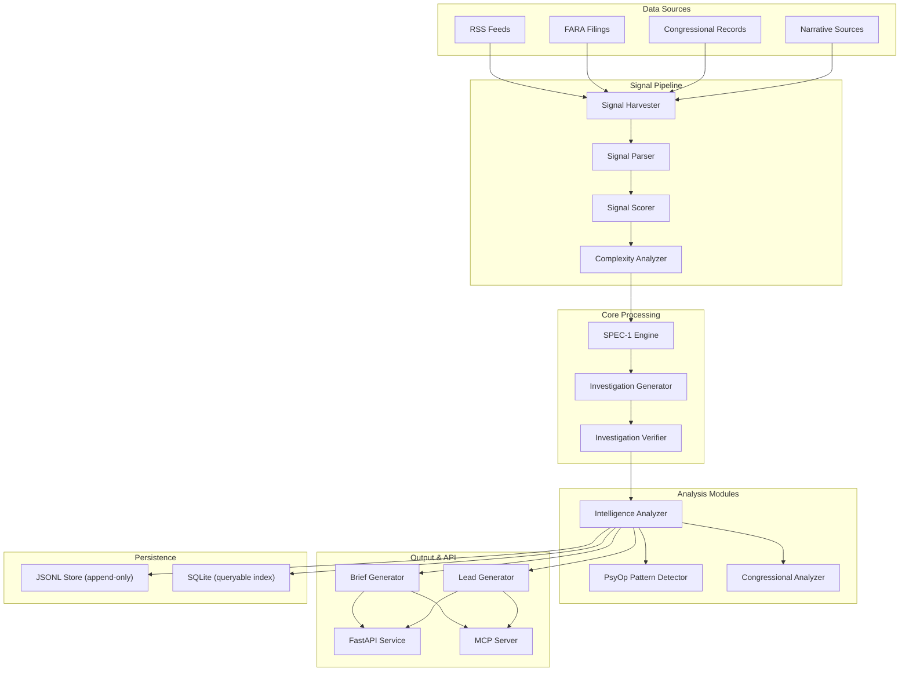

# SPEC-1 Architecture Overview

## System Architecture Diagram

## Module Organization

### Core Pipeline (`src/spec1_core/`)

| Module | Responsibility |
|---|---|
| `signal/` | Harvesting, parsing, and scoring raw signals from multiple sources |
| `investigation/` | Generating and verifying investigations based on scored signals |
| `intelligence/` | Analyzing signals and storing results |
| `analysts/` | Managing analyst credibility weighting and discovery |
| `briefing/` | Generating daily world briefs (Claude Sonnet + fallback) |
| `congressional/` | Specialized congressional records processing |
| `workspace/` | Persistent investigation case files and tracking |
| `tools/` | Operational CLIs (historical briefs, calibration, PDF rendering) |

### Extended Processing (`src/cls_*`)

| Module | Purpose |
|---|---|
| `cls_osint/` | Extended OSINT adapters (FARA, Congressional, Narrative) |
| `cls_world_brief/` | Daily intelligence brief production |
| `cls_leads/` | Actionable intelligence leads generation |
| `cls_psyop/` | Psychological operation pattern detection |
| `cls_verdicts/` | Human feedback loop (ground truth labeling) |
| `cls_calibration/` | Drift detection and calibration reporting |
| `cls_pdx1/` | Portland Metro civic intelligence (Notitia Civica) |
| `cls_research/` | Analyst-defined topic dossier research mode |

### Storage & API

| Component | Function |
|---|---|
| `cls_db/` | SQLite persistence layer with connection pooling |
| `spec1_api/` | FastAPI HTTP endpoints (`/api/v1`) |
| JSONL | Append-only event stream for all records |
| MCP Server | Claude integration and extended LLM capabilities |

## Data Flow

1. **Harvest** → Collect signals from RSS, FARA, Congressional, Narrative sources
2. 2. **Parse** → Normalize and structure raw signals
   3. 3. **Score** → Evaluate confidence and relevance (4-gate pipeline)
      4. 4. **Investigate** → Generate and verify investigation hypotheses
         5. 5. **Analyze** → Apply domain-specific analyzers (PsyOp, Congressional)
            6. 6. **Output** → Produce briefs, leads, and intelligence records
               7. 7. **Persist** → Dual-write to JSONL and SQLite
                  8. 8. **Feedback** → Collect human verdicts and surface calibration drift
                    
                     9. ## Key Characteristics
                    
                     10. - **Real-time OSINT:** Continuous harvesting and scoring of signals
                         - - **Confidence-based:** Multi-gate pipeline filters low-confidence signals
                           - - **Human-in-the-loop:** Verdict system captures analyst feedback
                             - - **Drift detection:** Surfaces model calibration issues without auto-tuning
                               - - **Multiple outputs:** Briefs, leads, PsyOp patterns, research dossiers
                                 - - **Dual persistence:** JSONL (events) + SQLite (queries)
                                   - - **API-first:** HTTP and MCP server interfaces
                                     - - **Extensible:** Modular architecture for new signal sources and analyzers
                                      
                                       - ## Language Composition
                                      
                                       - - **Python:** 76.9% (Core engine, pipelines, analysis)
                                         - - **HTML:** 22.4% (Templating, briefing output)
                                           - - **Other:** 0.7%
